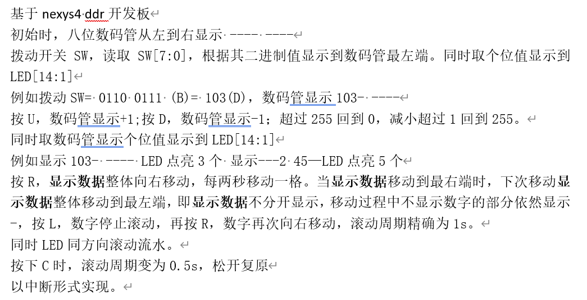

# 一些题目和对应代码

- 只有`main`我上板子跑过，其他都是基于ai和经验判断，希望可以用于参考
- 有发现问题和新内容欢迎提交issue和pr
~~我们班就是最简单那个~~

## 题目

- `headfile.h` 是一个头文件，我懒得复制那堆东西。
- `main.c` 初始数码管低两位显示0，按下按键u后显示按键u按下的次数，大于20时清0，按下L清零。中断实现，注意按键消抖
- `main1.c` 拨动开关SW，读取SW[2:0]，根据其值显示到LED[7:0]。例如拨动SW=101,LED点亮5个。按L，点亮数+1;按R，点亮数-1；超过8回到1，减小超过1回到8。采用中断实现。
- `main2.c` 初始时，八位数码管从左到右显示2026，没有数字的数码管显示-，按R，显示数据整体向右移动，每两秒移动一格。当6移动到最右端时，下次移动2026整体移动到最左端，即2026不分开显示，移动过程中不显示数字的部分依然显示-，按L，数字停止滚动，再按R，数字再次向右移动，滚动周期精确为1s，以中断形式实现。
- `main3.c` 点击按键C,8位LED灯（LED[7:0]),显示固定初值11110000，其余LED熄灭;点击按键L，LED以频率1Hz向左循环移动，如（11110000变为11100001）;再次点击按键L，LED以频率1Hz向右循环移动；再次点击按键L，停止移动并保持当前位置显示;要求以中断方式实现。向左循环移动：LED到达最左端后，下次左移将回到最右端；向右循环同理。

## 测试题

- ~~写完这道题，已经没有什么可以难倒你的了~~